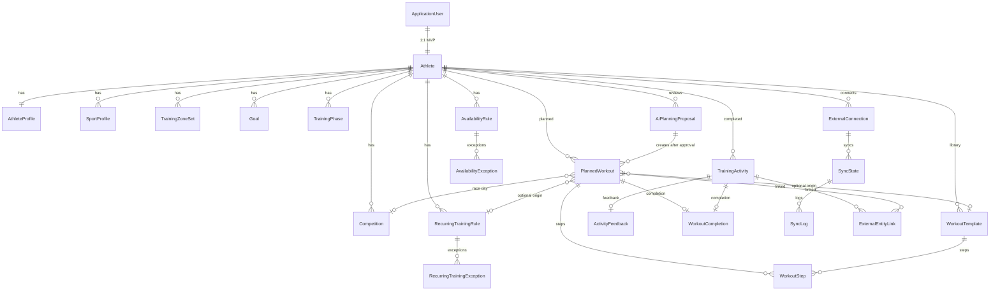

# Training Planner

## Product and Architecture Plan

**Status:** Planning only. Do not treat this document as an implementation.
**Audience:** Product, architecture, and backend implementation.
**Stack:** .NET 10, ASP.NET Core MVC, Razor, EF Core, PostgreSQL, Identity, HTMX, Bootstrap 5, Hangfire, Serilog, OpenTelemetry, xUnit, Testcontainers, Docker.

This is a single-athlete product at launch. Every athlete-owned record still carries `AthleteId` so multi-user support later is a data and authorization change, not a domain rewrite.

The existing repository already generates synthetic wrestling FIT files and uploads them to Garmin Connect via GitHub Actions (`FitChamp`). Training Planner treats that pipeline as an optional activity *source*, not as the core product. Completed wrestling can reach PostgreSQL through Intervals.icu (Garmin → Intervals.icu → import) or later through a direct authenticated POST.

---

## Table of contents

1. [Product summary](#1-product-summary)
2. [Main user journeys](#2-main-user-journeys)
3. [Functional requirements](#3-functional-requirements)
4. [Non-functional requirements](#4-non-functional-requirements)
5. [MVP scope](#5-mvp-scope)
6. [Features excluded from MVP](#6-features-excluded-from-mvp)
7. [Domain model](#7-domain-model)
8. [Aggregate boundaries](#8-aggregate-boundaries)
9. [Entity relationships](#9-entity-relationships)
10. [PostgreSQL schema proposal](#10-postgresql-schema-proposal)
11. [Activity import architecture](#11-activity-import-architecture)
12. [Intervals.icu integration](#12-intervalsicu-integration)
13. [Future Zwift integration](#13-future-zwift-integration)
14. [Future Garmin integration](#14-future-garmin-integration)
15. [GitHub Action integration](#15-github-action-integration)
16. [Recurring training design](#16-recurring-training-design)
17. [Availability design](#17-availability-design)
18. [Goal and competition design](#18-goal-and-competition-design)
19. [Planned workout model](#19-planned-workout-model)
20. [Workout step model](#20-workout-step-model)
21. [Planned vs actual matching](#21-planned-vs-actual-matching)
22. [RPE / Feeling handling](#22-rpe--feeling-handling)
23. [Training load model](#23-training-load-model)
24. [TrainingContext](#24-trainingcontext)
25. [OpenAI integration](#25-openai-integration)
26. [AI structured output proposal](#26-ai-structured-output-proposal)
27. [Training plan validation](#27-training-plan-validation)
28. [Background jobs](#28-background-jobs)
29. [Synchronization and idempotency](#29-synchronization-and-idempotency)
30. [MVC page structure](#30-mvc-page-structure)
31. [Project and folder structure](#31-project-and-folder-structure)
32. [Security](#32-security)
33. [Logging / observability](#33-logging--observability)
34. [Testing strategy](#34-testing-strategy)
35. [Docker development environment](#35-docker-development-environment)
36. [Ordered implementation roadmap](#36-ordered-implementation-roadmap)
37. [Architectural risks](#37-architectural-risks)
38. [Decisions still required before coding](#38-decisions-still-required-before-coding)

[Recommended first vertical slice](#recommended-first-vertical-slice)

---

## 1. Product summary

Training Planner is a personal endurance-training operating system. It owns the plan. External platforms own devices, files, and athlete-facing calendars.

The product exists because Intervals.icu, Zwift, Garmin, and a language model are each good at part of the problem and none of them should become the system of record:

- Intervals.icu is an excellent activity hub and a practical calendar destination.
- Zwift and Garmin are future sources and destinations.
- OpenAI can propose structure, but it must not silently mutate the calendar or call vendor APIs.
- Wrestling sessions are real training stress even when they arrive with no RPE, no Feeling, and synthetic HR.

The athlete works in one place:

1. Import completed work into PostgreSQL.
2. Declare goals, races, fixed training, and availability.
3. Ask the planner for a proposal.
4. Review explanations and validation.
5. Approve.
6. See the week on an internal calendar.
7. Push approved workouts to Intervals.icu.

The internal training model is provider-independent. Provider DTOs never leak into Domain. Pages, analytics, matching, and AI all read PostgreSQL.

**Core promise:** the calendar remains useful if Intervals.icu is down, if OpenAI is down, and if a wrestling session has no subjective scores.

---

## 2. Main user journeys

### 2.1 First-run setup

1. Register / log in (ASP.NET Core Identity).
2. Create athlete profile: sports, max HR, LTHR, FTP, preferred rest day, long-ride day, max hard sessions.
3. Connect Intervals.icu with athlete id + API key (MVP personal-use auth).
4. Trigger initial import (last 90 or 180 days).
5. See imported activities on Activities and a basic week calendar.
6. Add Tuesday/Thursday wrestling as locked recurring training.
7. Add weekly availability caps.
8. Add at least one A-priority race or season goal.

### 2.2 Weekly planning

1. Open Planner → Generate next 7 days (optional instruction: “easier week, indoor Thursday”).
2. System builds `TrainingContext` from PostgreSQL summaries.
3. OpenAI returns structured workouts plus explanations.
4. `TrainingPlanValidator` adds errors and warnings.
5. Athlete edits, accepts, or rejects items.
6. Approved workouts persist as `PlannedWorkout`.
7. Hangfire exports them to Intervals.icu using `external_id`.

### 2.3 Execute and adapt

1. Athlete completes a ride (Garmin/Zwift → Intervals.icu).
2. Scheduled or manual sync imports the activity.
3. Matcher links it to Sunday’s planned Z2 ride.
4. Planned vs actual shows 90 min / RPE 3 expected vs 105 min / RPE 7 / Feeling Poor.
5. Next generation uses that delta. Wednesday threshold may become recovery, with a stored explanation.

### 2.4 Fixed wrestling week

1. Recurring rule expands to Tue 19:00 and Thu 19:00.
2. AI must not move those sessions.
3. Availability on those weekdays is “wrestling only” or a hard cap that still fits 90 minutes.
4. After GitHub Action / Garmin / Intervals import, the completed wrestling activity matches the planned slot.
5. Missing RPE is normal. Load comes from sport default or duration × configured intensity.

### 2.5 Missed or shortened session

1. Planned 3 h endurance. Actual 1 h 35, RPE 8, Feeling Poor.
2. Status becomes `PartiallyCompleted`.
3. Chat or “Replan rest of week” creates a proposal, not a silent rewrite.
4. Validator still protects Thursday wrestling and any A-race.

### 2.6 Sync and recovery

1. Dashboard shows last successful Intervals sync.
2. Athlete clicks Sync now.
3. Failures are visible with provider, time, status code, and retry count.
4. Already stored activities remain on the calendar.

---

## 3. Functional requirements

### Identity and athlete

- FR-01 Login / logout with Identity cookies.
- FR-02 One athlete profile per user at MVP; `AthleteId` on all training data.
- FR-03 Sport profiles with optional FTP, HR, pace, default load, and whether RPE/Feeling are required.
- FR-04 Training zones (HR, power, pace) stored internally; Intervals values may seed them later.

### Activities

- FR-10 Import completed activities from Intervals.icu into PostgreSQL.
- FR-11 Display activity list and detail from local data only.
- FR-12 Incremental, idempotent, retryable sync with manual “Sync now”.
- FR-13 Provider-agnostic `TrainingActivity`; optional metrics stay null.
- FR-14 Provider links so one internal activity can map to Intervals, Zwift, Garmin, GitHub Action.
- FR-15 Duplicate protection within a provider and heuristic cross-provider matching.
- FR-16 Optional authenticated ingest endpoint for GitHub Action / manual sources.

### Calendar and schedule

- FR-20 Day / week / month views. Week is the MVP primary view.
- FR-21 Show planned workouts, completed activities, recurring expansions, races, rest, unavailable days.
- FR-22 Sport-specific visual distinction.
- FR-23 Workout statuses: Planned, Completed, PartiallyCompleted, Skipped, Cancelled.
- FR-24 Locked entries and optional workouts.
- FR-25 Quick edit. Drag-and-drop can be a later enhancement of the same mutation API.
- FR-26 Planned vs actual on the same day cell.

### Recurring training and availability

- FR-30 Recurring rules (weekday + time + duration + validity window), not pre-materialized year-long rows.
- FR-31 Exceptions: cancelled, holiday, vacation, competition, special training.
- FR-32 `Locked` and `AiMayMove` flags.
- FR-33 Availability rules separate from recurring training.
- FR-34 Availability exceptions (work, family, vacation, short-term caps).

### Goals and competitions

- FR-40 Multiple goals with type, priority, target date/value, active/archived.
- FR-41 A/B/C race priority.
- FR-42 Competitions appear on the calendar.
- FR-43 Planner never auto-moves an A-race.

### Planning and workouts

- FR-50 Planned workouts are distinct from completed activities.
- FR-51 Structured steps with warmup/steady/interval/recovery/repeat/cooldown/open.
- FR-52 Workout templates: create, edit, duplicate, schedule, AI-generate, export.
- FR-53 Training phases influence generation.
- FR-54 WorkoutCompletion links planned ↔ actual.

### AI

- FR-60 Generate next workout / 7 days / 4 weeks as proposals.
- FR-61 Transform operations: easier, harder, shorten, indoor/outdoor, HR/power, replan.
- FR-62 Explanations stored with enough context to reproduce.
- FR-63 Deterministic `TrainingPlanValidator` before approval.
- FR-64 Coach chat produces proposals, not silent calendar writes.
- FR-65 Weekly review from local summaries, with optional AI narrative.

### Integrations

- FR-70 Intervals.icu: import activities, export planned workouts, upsert by external id.
- FR-71 Architecture seams for Zwift and Garmin adapters. No MVP implementation.
- FR-72 OpenAI is an adapter behind `IAiTrainingPlanner`.

### Dashboard and navigation

- FR-80 Dashboard: next workout first, plus today, fixed training, next race, volume, load, RPE/Feeling trend, sync status, AI recommendation.
- FR-81 Navigation: Dashboard, Calendar, Activities, Goals, Planner, Workouts, Schedule, Analytics, Integrations, Settings.

---

## 4. Non-functional requirements

| Area | Requirement |
| --- | --- |
| Source of truth | PostgreSQL. Pages never live-query Intervals.icu or OpenAI for historical training data. |
| Availability | Calendar and activity history work when vendors are down. |
| Consistency | Sync jobs are idempotent. Duplicate provider IDs cannot insert twice. |
| Latency | Interactive pages serve from local DB. AI generation is an explicit user action with progress UI. |
| Security | Identity cookies; no plaintext tokens; no secrets in logs. |
| Observability | Structured logs, correlation IDs, traces around sync/AI/export. |
| Testability | Domain and mapping logic unit-tested; PostgreSQL via Testcontainers. |
| Operability | Docker Compose for local/prod-like runs. Hangfire dashboard behind auth. |
| Simplicity | Four projects. No MediatR, no generic repository layer, no extra worker host in MVP. |
| Extensibility | New activity source = new Infrastructure adapter + mapping tests. |

**Decision — Hangfire in the web process for MVP.**
Why: one deployable, enough for a single athlete.
Alternative: dedicated worker project. Do that only if job runtime starts blocking HTTP.

**Decision — Bootstrap 5, not Tailwind, for MVP.**
Why: Razor + HTMX needs no npm pipeline; Bootstrap is enough for calendar grids and forms.
Alternative: Tailwind later if design density needs it. Do not mix both.

---

## 5. MVP scope

Intentionally small, but end-to-end:

1. Identity login and a single athlete profile.
2. PostgreSQL via EF Core migrations.
3. Connect Intervals.icu (athlete id + API key).
4. Background + manual import of completed activities.
5. Activity history pages from local data.
6. Basic calendar (week required; month if cheap).
7. Recurring wrestling rule (locked, AI may not move).
8. Weekly availability rules.
9. Goals (at least Race + GeneralFitness/BaseTraining).
10. Structured planned workouts (internal model).
11. AI: generate next 7 days from `TrainingContext`.
12. `TrainingPlanValidator`.
13. User approval → store planned workouts.
14. Export approved workouts to Intervals.icu (idempotent).
15. Import completed activity and match to planned workout.
16. Include planned-vs-actual in the *next* AI request.

Wrestling in MVP can arrive as a completed Intervals activity after the existing Garmin upload. Do not rebuild FIT generation inside Training Planner for MVP.

---

## 6. Features excluded from MVP

- Direct Garmin API (import, Training API, FIT push from this app).
- Direct Zwift API / ZWO push (internal model must still be translatable later).
- Weather-aware planning.
- Nutrition.
- Equipment maintenance.
- Coach / multi-athlete product mode.
- Native mobile apps.
- Advanced race prediction / power-duration modelling beyond simple targets.
- Full medical readiness / HRV scoring (Intervals wellness import can wait).
- Drag-and-drop polish, month heatmap analytics, and full workout library UX.
- OAuth app registration for Intervals (personal API key is enough for one user).
- Webhooks from Intervals (polling + Sync now is enough).
- Chat-driven planning as a required MVP surface (the proposal engine should allow it; the chat UI can follow).

Keep seams. Do not build the features.

---

## 7. Domain model

Domain lives in `TrainingPlanner.Domain`. No EF, HTTP, or vendor types.

### 7.1 Enums and value objects

```csharp
public enum Sport { Cycling, Running, Swimming, Wrestling, Strength, Other }

public enum WorkoutStatus { Planned, Completed, PartiallyCompleted, Skipped, Cancelled }

public enum GoalType
{
    Race, Distance, FinishTime, Ftp, Pace, BodyWeight,
    WeeklyVolume, GeneralFitness, BaseTraining
}

public enum GoalPriority { A, B, C }

public enum TrainingPhaseType { Base, Build, Specialization, Peak, Taper, Recovery }

public enum Feeling { VeryPoor, Poor, Normal, Good, VeryGood }

public enum IntensityBand { Recovery, Endurance, Tempo, Threshold, Vo2, Anaerobic, Sprint, Hard, Unknown }

public enum StepKind { Warmup, Steady, Interval, Recovery, Repeat, Cooldown, Open }

public enum TargetKind
{
    HeartRateZone, HeartRateBpm, PowerZone, Watts, PercentFtp,
    Pace, Cadence, Rpe, FreeRide, None
}

public enum AvailabilityKind { Available, Unavailable, SportOnly, TimeCapped }

public enum RecurrenceExceptionKind { Cancelled, Holiday, Vacation, Competition, SpecialTraining }

public enum LoadSource { Provider, HeartRate, Power, SessionRpe, ConfiguredDefault, DurationHeuristic, Unknown }

public enum ExternalProvider { IntervalsIcu, Zwift, Garmin, GitHubAction, Manual }

public enum ExternalEntityType { Activity, PlannedWorkout, WorkoutTemplate, AthleteProfile }
```

Value objects (records): `HeartRate`, `PowerWatts`, `DistanceMeters`, `DurationSeconds`, `TrainingLoad`, `Rpe` (1–10), `DateRange`, `TimeWindow`, `WeekdaySchedule`.

`Rpe` and `Feeling` are optional. Never coerce missing values to 0 or “Normal”.

### 7.2 Core entities (conceptual)

**Identity / athlete**

- `Athlete` — stable planning identity (`Id`, `UserId`, `TimeZoneId`, `DisplayName`).
- `AthleteProfile` — preferences: preferred long-ride day, rest day, max hard sessions, indoor/outdoor bias, preferred target (HR vs power).
- `SportProfile` — per sport: FTP, LTHR, threshold pace, max HR, default intensity, default planning load, `RpeRequired`, `FeelingRequired`.
- `TrainingZoneSet` + `ZoneRange` — numbered zones with low/high bounds.

**Planning inputs**

- `Goal`
- `Competition`
- `TrainingPhase` — date-bounded phase.
- `AvailabilityRule` + `AvailabilityException`
- `RecurringTrainingRule` + `RecurringTrainingException`

**Execution**

- `TrainingActivity` — completed, provider-normalized.
- `ActivityFeedback` — optional RPE/Feeling/notes, possibly edited locally after import.
- `PlannedWorkout` + `WorkoutStep`
- `WorkoutTemplate` + template steps
- `WorkoutCompletion`

**Integrations / AI / sync**

- `ExternalConnection`
- `ExternalEntityLink`
- `SyncState` + `SyncLog`
- `AiPlanningProposal` + snapshot of `TrainingContext` and structured result

### 7.3 TrainingActivity

Provider-independent. Null means unknown, not zero.

| Field | Notes |
| --- | --- |
| Id | Guid |
| AthleteId | Required |
| Sport | Required |
| ActivityType | Optional free-form (`Ride`, `VirtualRide`, `MMA`, …) |
| Name | Optional |
| StartTime, EndTime | `DateTimeOffset`; EndTime optional |
| Duration | Moving/elapsed; store both if providers differ |
| DistanceMeters, ElevationGainMeters | Optional |
| AverageHeartRate, MaximumHeartRate | Optional |
| AveragePower, NormalizedPower | Optional |
| Cadence, Calories | Optional |
| TrainingLoad, TrainingLoadSource | Optional |
| TrainingEffect | Optional decimal/text; do not require |
| Rpe, Feeling | Optional; also see ActivityFeedback |
| Notes | Optional |
| Indoor | Optional bool |
| SourceProvider | Original ingest provider |
| ImportedAt, UpdatedAt | Audit |

Cycling may have power. Running may not. Wrestling often has neither power nor RPE. Persist what arrived.

### 7.4 Design choice — Athlete as first-class entity

**Recommended:** `Athlete` separate from Identity `ApplicationUser`.
Why: login identity and training identity change at different rates (future family sharing, coach mode).
Alternative: put profile columns on `ApplicationUser`. Fine for a weekend prototype; slightly more painful later.

### 7.5 Design choice — no domain event bus in MVP

Raise in-process notifications via application services / Hangfire continuations (`MatchActivitiesJob` after import).
Alternative: MediatR notifications. Extra ceremony for one athlete.

---

## 8. Aggregate boundaries

Keep aggregates small. Cross-aggregate work is application-layer orchestration.

| Aggregate root | Contains | Invariants |
| --- | --- | --- |
| `Athlete` | Profile, sport profiles, zone sets | One profile; sports unique per athlete |
| `Goal` | — | Active goals have a type; A-races should have a date |
| `Competition` | — | Date required; A-priority competitions are immovable |
| `TrainingPhase` | — | Phases for an athlete should not overlap |
| `AvailabilityRule` | — | Weekday unique per athlete unless exceptions override |
| `RecurringTrainingRule` | Exceptions | Locked rules have `AiMayMove = false` |
| `TrainingActivity` | Feedback | Metrics nullable; links live in integration aggregate |
| `PlannedWorkout` | Steps | Steps durations consistent; locked/fixed flags honored |
| `WorkoutTemplate` | Steps | Template has a sport and non-empty name |
| `WorkoutCompletion` | — | One planned workout, one activity (MVP 1:1) |
| `ExternalConnection` | — | Secret material encrypted; one connection per provider per athlete |
| `ExternalEntityLink` | — | Unique `(Provider, EntityType, ExternalId)` |
| `SyncState` | Logs (or logs as separate append-only) | One state per athlete/provider/job kind |
| `AiPlanningProposal` | Result JSON, context snapshot, review fields | Approval required before calendar mutation |

**Recommended:** `ExternalEntityLink` is its own aggregate, not a collection on `TrainingActivity`.
Why: the same link table serves activities, planned workouts, and templates; matching/dedup jobs can run without loading full activity graphs.
Alternative: JSON column of provider IDs on the activity. Cheaper to start, worse unique constraints and multi-entity types.

**Recommended:** expand recurring rules at read/planning time; do not insert 200 `PlannedWorkout` rows for a season of wrestling.
Why: exceptions stay cheap; AI sees “fixed occurrences in range”.
Alternative: materialize the next N weeks into planned workouts. Acceptable later if calendar queries get awkward; not the default.

---

## 9. Entity relationships



Rules:

- `WorkoutCompletion` is the only planned↔actual join. Do not put `CompletedActivityId` on `PlannedWorkout` as the long-term model (a short FK cache is OK).
- A `Competition` may also be represented as a locked `PlannedWorkout` of kind Race, or as a calendar overlay. **Recommended:** `Competition` entity plus a locked calendar item, not only a note on a workout.
- `ExternalEntityLink.InternalEntityId` is a Guid pointing at activity/workout/template; `EntityType` tells which table. Avoid polymorphic EF mappings; query links explicitly.

---

## 10. PostgreSQL schema proposal

Use EF Core migrations. Npgsql. Identity tables standard. Application tables sketched below (snake_case in DB, Pascal in C#).

### 10.1 Identity and athlete

```text
athletes
  id uuid PK
  user_id uuid UNIQUE NOT NULL  -- FK Identity
  display_name text NOT NULL
  time_zone_id text NOT NULL DEFAULT 'Europe/Berlin'
  created_at timestamptz NOT NULL
  updated_at timestamptz NOT NULL

athlete_profiles
  athlete_id uuid PK FK
  preferred_long_session_weekday smallint NULL
  preferred_rest_weekday smallint NULL
  max_hard_sessions_per_week smallint NULL
  preferred_target_kind text NULL      -- HeartRate | Power | Pace | Rpe
  indoor_preference text NULL          -- Indoor | Outdoor | Either
  notes text NULL

sport_profiles
  id uuid PK
  athlete_id uuid NOT NULL
  sport text NOT NULL
  max_heart_rate int NULL
  threshold_heart_rate int NULL
  ftp_watts int NULL
  threshold_pace_seconds_per_km int NULL
  default_intensity text NULL
  default_planning_load numeric NULL
  rpe_required boolean NOT NULL DEFAULT false
  feeling_required boolean NOT NULL DEFAULT false
  UNIQUE (athlete_id, sport)

training_zone_sets
  id uuid PK
  athlete_id uuid NOT NULL
  sport text NOT NULL
  kind text NOT NULL                   -- HeartRate | Power | Pace
  UNIQUE (athlete_id, sport, kind)

zone_ranges
  id uuid PK
  zone_set_id uuid NOT NULL
  zone_number int NOT NULL
  name text NULL
  lower_bound numeric NOT NULL
  upper_bound numeric NULL             -- null = unbounded
```

### 10.2 Goals, competitions, phases

```text
goals
  id uuid PK
  athlete_id uuid NOT NULL
  name text NOT NULL
  description text NULL
  sport text NULL
  goal_type text NOT NULL
  priority text NOT NULL               -- A|B|C
  target_date date NULL
  target_value numeric NULL
  target_unit text NULL
  current_value numeric NULL
  is_active boolean NOT NULL DEFAULT true
  is_archived boolean NOT NULL DEFAULT false

competitions
  id uuid PK
  athlete_id uuid NOT NULL
  name text NOT NULL
  date date NOT NULL
  sport text NOT NULL
  priority text NOT NULL
  target_text text NULL
  notes text NULL
  goal_id uuid NULL

training_phases
  id uuid PK
  athlete_id uuid NOT NULL
  phase_type text NOT NULL
  name text NULL
  start_date date NOT NULL
  end_date date NOT NULL
  EXCLUDE USING gist (athlete_id WITH =, daterange(start_date, end_date, '[]') WITH &&)
  -- gist exclusion optional later; application-validate in MVP
```

### 10.3 Availability and recurrence

```text
availability_rules
  id uuid PK
  athlete_id uuid NOT NULL
  weekday smallint NOT NULL            -- 0-6 or ISO 1-7; pick ISO 1-7
  kind text NOT NULL                   -- Available | Unavailable | SportOnly | TimeCapped
  max_duration_seconds int NULL
  sport text NULL                      -- for SportOnly
  valid_from date NULL
  valid_until date NULL
  UNIQUE (athlete_id, weekday, valid_from)  -- keep simple; exceptions handle one-offs

availability_exceptions
  id uuid PK
  athlete_id uuid NOT NULL
  date date NOT NULL
  kind text NOT NULL
  max_duration_seconds int NULL
  sport text NULL
  reason text NULL
  UNIQUE (athlete_id, date)

recurring_training_rules
  id uuid PK
  athlete_id uuid NOT NULL
  name text NOT NULL
  sport text NOT NULL
  weekday smallint NOT NULL
  start_time time NOT NULL
  duration_seconds int NOT NULL
  valid_from date NOT NULL
  valid_until date NULL
  is_locked boolean NOT NULL DEFAULT true
  ai_may_move boolean NOT NULL DEFAULT false
  default_intensity text NULL
  default_planning_load numeric NULL
  rpe_required boolean NOT NULL DEFAULT false
  feeling_required boolean NOT NULL DEFAULT false

recurring_training_exceptions
  id uuid PK
  rule_id uuid NOT NULL
  date date NOT NULL
  kind text NOT NULL
  replacement_start_time time NULL
  replacement_duration_seconds int NULL
  notes text NULL
  UNIQUE (rule_id, date)
```

### 10.4 Activities and planned work

```text
training_activities
  id uuid PK
  athlete_id uuid NOT NULL
  sport text NOT NULL
  activity_type text NULL
  name text NULL
  start_time timestamptz NOT NULL
  end_time timestamptz NULL
  duration_seconds int NULL
  elapsed_seconds int NULL
  distance_meters numeric NULL
  elevation_gain_meters numeric NULL
  average_heart_rate int NULL
  maximum_heart_rate int NULL
  average_power int NULL
  normalized_power int NULL
  cadence int NULL
  calories int NULL
  training_load numeric NULL
  training_load_source text NULL
  training_effect numeric NULL
  indoor boolean NULL
  notes text NULL
  source_provider text NOT NULL
  imported_at timestamptz NOT NULL
  updated_at timestamptz NOT NULL

activity_feedback
  activity_id uuid PK FK
  rpe int NULL CHECK (rpe IS NULL OR rpe BETWEEN 1 AND 10)
  feeling text NULL
  notes text NULL
  source text NOT NULL                 -- Provider | Athlete
  updated_at timestamptz NOT NULL

planned_workouts
  id uuid PK
  athlete_id uuid NOT NULL
  sport text NOT NULL
  name text NOT NULL
  scheduled_date date NOT NULL
  start_time time NULL
  duration_seconds int NULL
  status text NOT NULL
  intensity text NULL
  expected_rpe int NULL
  planned_load numeric NULL
  is_optional boolean NOT NULL DEFAULT false
  is_locked boolean NOT NULL DEFAULT false
  ai_may_move boolean NOT NULL DEFAULT true
  indoor boolean NULL
  notes text NULL
  explanation text NULL
  recurring_rule_id uuid NULL
  template_id uuid NULL
  competition_id uuid NULL
  proposal_id uuid NULL
  created_at timestamptz NOT NULL
  updated_at timestamptz NOT NULL

workout_steps
  id uuid PK
  planned_workout_id uuid NULL
  template_id uuid NULL
  parent_step_id uuid NULL             -- Repeat groups
  sort_order int NOT NULL
  kind text NOT NULL
  duration_seconds int NULL
  repeat_count int NULL
  target_kind text NULL
  target_low numeric NULL
  target_high numeric NULL
  zone_number int NULL
  notes text NULL

workout_templates
  id uuid PK
  athlete_id uuid NOT NULL
  name text NOT NULL
  sport text NOT NULL
  duration_seconds int NULL
  planned_load numeric NULL
  created_at timestamptz NOT NULL

workout_completions
  id uuid PK
  athlete_id uuid NOT NULL
  planned_workout_id uuid NOT NULL UNIQUE
  activity_id uuid NOT NULL UNIQUE
  match_confidence numeric NOT NULL
  match_kind text NOT NULL             -- Automatic | Manual
  duration_ratio numeric NULL
  load_ratio numeric NULL
  rpe_delta int NULL
  created_at timestamptz NOT NULL
```

### 10.5 Integrations, sync, AI

```text
external_connections
  id uuid PK
  athlete_id uuid NOT NULL
  provider text NOT NULL
  external_athlete_id text NULL
  encrypted_payload bytea NOT NULL     -- tokens / api key via Data Protection
  is_enabled boolean NOT NULL DEFAULT true
  created_at timestamptz NOT NULL
  updated_at timestamptz NOT NULL
  UNIQUE (athlete_id, provider)

external_entity_links
  id uuid PK
  athlete_id uuid NOT NULL
  provider text NOT NULL
  entity_type text NOT NULL
  internal_entity_id uuid NOT NULL
  external_id text NOT NULL
  external_updated_at timestamptz NULL
  last_synced_at timestamptz NOT NULL
  UNIQUE (provider, entity_type, external_id)
  UNIQUE (provider, entity_type, internal_entity_id)

sync_states
  id uuid PK
  athlete_id uuid NOT NULL
  provider text NOT NULL
  job_kind text NOT NULL               -- Activities | PlannedWorkouts | Tokens
  cursor text NULL                     -- ISO timestamp or opaque
  window_from timestamptz NULL
  last_success_at timestamptz NULL
  last_attempt_at timestamptz NULL
  last_error text NULL
  status text NOT NULL                 -- Idle | Running | Failed | Partial
  UNIQUE (athlete_id, provider, job_kind)

sync_logs
  id uuid PK
  sync_state_id uuid NOT NULL
  started_at timestamptz NOT NULL
  finished_at timestamptz NULL
  status text NOT NULL
  activities_fetched int NULL
  activities_inserted int NULL
  activities_updated int NULL
  duplicates_skipped int NULL
  http_status int NULL
  error_code text NULL
  message text NULL
  correlation_id text NULL

ai_planning_proposals
  id uuid PK
  athlete_id uuid NOT NULL
  instruction text NULL
  horizon text NOT NULL                -- NextWorkout | Next7Days | Next4Weeks | Chat
  status text NOT NULL                 -- Draft | Validated | Approved | Rejected | Applied
  context_json jsonb NOT NULL
  model_name text NOT NULL
  response_json jsonb NOT NULL
  validation_json jsonb NULL
  created_at timestamptz NOT NULL
  reviewed_at timestamptz NULL
```

Optional materialized summaries (can wait until week 2 of implementation if queries stay cheap):

```text
training_summaries
  athlete_id uuid NOT NULL
  period_kind text NOT NULL            -- Day | Week
  period_start date NOT NULL
  sport text NULL                      -- null = all sports
  duration_seconds int NOT NULL
  load numeric NULL
  average_rpe numeric NULL
  PRIMARY KEY (athlete_id, period_kind, period_start, COALESCE(sport, ''))
```

### 10.6 Indexes

| Index | Why |
| --- | --- |
| `training_activities (athlete_id, start_time)` | Calendar, history, AI window |
| `training_activities (athlete_id, sport, start_time)` | Sport filters |
| `planned_workouts (athlete_id, scheduled_date)` | Calendar / validator |
| `competitions (athlete_id, date)` | Upcoming race |
| `external_entity_links (provider, entity_type, external_id)` UNIQUE | Idempotent ingest |
| `goals (athlete_id) WHERE is_active` | Planner context |
| `sync_logs (sync_state_id, started_at DESC)` | Diagnostics |
| `ai_planning_proposals (athlete_id, created_at DESC)` | Planner UI |

### 10.7 Design choice — jsonb for AI snapshots, not a huge decomposed schema

Why: TrainingContext shape will change; reproduction needs the exact payload sent to the model.
Alternative: fully relational context tables. Over-structured for MVP.

---

## 11. Activity import architecture

### 11.1 Principle

```text
Provider API
    → Infrastructure DTO
    → map to ExternalActivity (application contract)
    → normalize / merge
    → TrainingActivity + ExternalEntityLink
    → PostgreSQL
    → calendar, analytics, matching, TrainingContext
```

The rest of the system never sees `IntervalsActivityDto`.

### 11.2 Contracts (Application layer)

**Recommended interface** (slightly richer than the prompt, still small):

```csharp
public interface IActivityProvider
{
    string ProviderName { get; }

    Task<IReadOnlyList<ExternalActivity>> GetActivitiesAsync(
        ActivityImportQuery query,
        CancellationToken cancellationToken);
}

public sealed record ActivityImportQuery(
    DateTimeOffset From,
    DateTimeOffset To,
    string? UpdatedSinceCursor = null);

public sealed class ExternalActivity
{
    public required string Provider { get; init; }
    public required string ExternalId { get; init; }
    public string? Name { get; init; }
    public required Sport Sport { get; init; }
    public string? ActivityType { get; init; }
    public required DateTimeOffset StartTime { get; init; }
    public DateTimeOffset? EndTime { get; init; }
    public int? DurationSeconds { get; init; }
    public int? ElapsedSeconds { get; init; }
    public decimal? DistanceMeters { get; init; }
    public decimal? ElevationGainMeters { get; init; }
    public int? AverageHeartRate { get; init; }
    public int? MaximumHeartRate { get; init; }
    public int? AveragePower { get; init; }
    public int? NormalizedPower { get; init; }
    public int? Cadence { get; init; }
    public int? Calories { get; init; }
    public decimal? TrainingLoad { get; init; }
    public LoadSource? TrainingLoadSource { get; init; }
    public int? Rpe { get; init; }
    public Feeling? Feeling { get; init; }
    public bool? Indoor { get; init; }
    public string? Notes { get; init; }
    public DateTimeOffset? ExternalUpdatedAt { get; init; }
}
```

Why this shape: callers pass a time window and optional “updated since” cursor; providers that cannot filter by update time still filter locally. Pagination can be added inside the Intervals adapter without changing the interface.

Alternative: `IAsyncEnumerable<ExternalActivity>` for huge histories. Unnecessary for 90–180 days.

Do **not** create `IFitnessProvider` that also publishes workouts and refreshes tokens. Split interfaces.

### 11.3 Pipeline

Application service `ImportActivitiesCommand`:

1. Load `ExternalConnection` + `SyncState`.
2. Resolve window: initial `now - lookback`; incremental `cursor - overlap` (e.g. 36 h overlap) through `now`.
3. Call `IActivityProvider`.
4. For each `ExternalActivity`:
   - If link exists for `(provider, Activity, externalId)` → update mutable fields (metrics, RPE, name).
   - Else run cross-provider duplicate detector.
   - Else insert `TrainingActivity` + link.
5. Advance cursor only after a successful pass.
6. Enqueue `MatchActivitiesToPlannedWorkoutsJob` and optional summary rebuild.
7. Write `SyncLog` (counts, duration, correlation id).

### 11.4 Duplicate strategy

1. **Hard guarantee:** unique `(provider, entity_type, external_id)`.
2. **Cross-provider:** same athlete, same sport (or compatible pair), start time within ±10 minutes, duration within ±10% or ±5 minutes. High confidence → add a second `ExternalEntityLink` to the existing activity. Low confidence → insert new activity and flag `possible_duplicate` in sync log for later UI.
3. **Never merge automatically across sports** (wrestling vs ride).

### 11.5 Resilience

- HTTP 429: honor `Retry-After`, Hangfire automatic retry with jitter.
- HTTP 5xx: retry.
- HTTP 401/403: fail the job, mark connection `NeedsReauth`, do not spin.
- Partial page failure: log, do not advance cursor past the failed window.

MVP implements only `IntervalsIcuActivityProvider`. Stubs or empty registrations for Zwift/Garmin are unnecessary; just keep the interface.

---

## 12. Intervals.icu integration

Intervals.icu is the MVP hub: activity source and workout destination. It is not the domain.

### 12.1 Auth (MVP)

**Recommended:** personal API key with HTTP Basic `API_KEY` / `{key}`, athlete id in the path (`i12345` or `0` meaning “the key’s athlete”).
Why: one user, no OAuth app review, matches Intervals’ own “working with your own data” path.
Alternative: OAuth 2.0 with scopes `ACTIVITY:READ`, calendar write. Do this if the product becomes multi-user.

Store athlete id in `external_connections.external_athlete_id`. Store the API key in `encrypted_payload` via ASP.NET Data Protection (not Identity password hasher; we need round-trip).

### 12.2 Import

Use:

```text
GET /api/v1/athlete/{id}/activities?oldest={yyyy-MM-dd}&newest={yyyy-MM-dd}
```

Map a **whitelist** of fields, including at least:

| Intervals field | Internal |
| --- | --- |
| `id` | ExternalId |
| `name` | Name |
| `type` / `icu_type` | Sport + ActivityType |
| `start_date` / `start_date_local` | StartTime (combine with athlete TZ) |
| `moving_time` / `elapsed_time` | Duration / Elapsed |
| `distance` | DistanceMeters |
| `total_elevation_gain` | ElevationGainMeters |
| `average_heartrate` / `max_heartrate` | HR |
| `average_watts` / `icu_weighted_avg_watts` | Power / NP |
| `average_cadence` | Cadence |
| `calories` | Calories |
| `icu_training_load` | TrainingLoad (`LoadSource.Provider`) |
| `icu_rpe` (and `perceived_exertion` if present) | Rpe |
| `feel` | Feeling after 1–5 normalization |
| `indoor` | Indoor |
| `updated` | ExternalUpdatedAt |

Keep Intervals DTOs in `Infrastructure/Integrations/IntervalsIcu/`.

Do not import streams/FIT for MVP. Summaries are enough for planning.

Sport mapping examples:

- `Ride`, `VirtualRide` → Cycling (`Indoor` true for virtual)
- `Run`, `VirtualRun` → Running
- `Swim` → Swimming
- `Workout`, `WeightTraining` → Strength
- MMA / wrestling-like types → Wrestling (config map; the current FIT upload uses Mixed Martial Arts)

Unknown types → `Sport.Other`, preserve `ActivityType`.

### 12.3 Export planned workouts

Intervals calendar events, not Intervals “workout library”, are the destination for scheduled sessions.

```text
POST /api/v1/athlete/{id}/events
POST /api/v1/athlete/{id}/events/bulk?upsert=true   # OAuth clients; verify API-key behavior
PUT  /api/v1/athlete/{id}/events/{eventId}
DELETE /api/v1/athlete/{id}/events/{eventId}
```

**Recommended export payload:** native Intervals description string generated from internal steps, plus `name`, `type`, `start_date_local`, `moving_time`, `icu_training_load`, `category=WORKOUT`, `external_id=tp:{plannedWorkoutId}`.

Why description text: Intervals documents that `workout_doc` is not accepted on create; description (or zwo/fit file) is.
Alternative later: generate ZWO from the internal model for Zwift-flavored workouts.

`IWorkoutPublisher` in Application; `IntervalsIcuWorkoutPublisher` in Infrastructure.

Idempotency:

- Persist `ExternalEntityLink` for `(IntervalsIcu, PlannedWorkout, eventId)`.
- Always send `external_id`.
- Update if link exists; create if not.
- Before create, optionally GET events in range and match `external_id` (recovery if DB link was lost).
- Delete/cancel: if user cancels locally, DELETE remote event or replace with a note — **recommended:** DELETE remote and set local status Cancelled. If Intervals delete fails, keep `PendingCancel` on the link.

Conflict detection (MVP-light):

- If remote `updated` is newer than `last_synced_at` and content differs, do not overwrite; log `Conflict` and surface on Integrations.

Webhooks (`ACTIVITY_UPLOADED`, `CALENDAR_UPDATED`) are post-MVP. Polling every 15–30 minutes plus Sync now is enough.

### 12.4 What not to do

- Do not query Intervals from Razor pages.
- Do not let AI call Intervals.
- Do not store raw Intervals JSON as the activity model (optional `raw_json` column is a debug hatch only; skip unless needed).

---

## 13. Future Zwift integration

Do not implement for MVP.

Planned adapter:

```text
Zwift → ZwiftActivityProvider → ExternalActivity → same ImportActivities pipeline
```

Calendar, analytics, matcher, weekly review, and AI must not change.

Notes for later:

- Zwift activities often also appear in Garmin and Intervals. Cross-provider duplicate detection is the feature that makes Zwift safe to add.
- Workout push would be a `IWorkoutPublisher` that emits ZWO from `WorkoutStep`. Internal steps must therefore stay publisher-agnostic (no Intervals description syntax in Domain).
- Indoor flag should already exist on `TrainingActivity` / `PlannedWorkout`.

---

## 14. Future Garmin integration

Do not implement for MVP. Do not make Garmin the activity source now.

Current repo fact: wrestling FIT files are uploaded to Garmin Connect by GitHub Actions. If the athlete’s Garmin is connected to Intervals.icu, those sessions already flow into Intervals and then into Training Planner. That is the intended MVP path.

Later Garmin adapter (Infrastructure only):

- Activity import (if Intervals is no longer the hub).
- Garmin Training API / workout push.
- RPE / Feeling if Garmin provides them.
- FIT ingest.

Keep Garmin credentials out of Domain. The existing `garminconnect` Python script is a legacy sidecars; Training Planner should not call Garmin passwords from the web app.

---

## 15. GitHub Action integration

Optional, authenticated, idempotent ingest. Useful when wrestling should land in Training Planner even if Garmin/Intervals fail.

### 15.1 Recommended shape

MVC-safe API controller in Web, application command in Application:

```text
POST /api/external/activities
Authorization: Bearer {GitHubAction:ingest-secret}
Idempotency-Key: ringen-2026-09-15
```

```json
{
  "source": "GitHubAction",
  "externalId": "ringen-2026-09-15",
  "sport": "Wrestling",
  "activityType": "MixedMartialArts",
  "name": "Ringen Training",
  "startTime": "2026-09-15T17:00:00+02:00",
  "durationSeconds": 5400,
  "notes": "Club practice"
}
```

No RPE, no Feeling. That is valid.

Handler:

1. Authenticate (shared secret in configuration, compared with fixed-time equals; or HMAC of body).
2. Map to `ExternalActivity`.
3. Reuse the same import/upsert pipeline as Intervals (`IActivityIngestService`).
4. Return `201` with internal id, or `200` if it already existed.

**Recommended auth for MVP:** a single `ExternalIngest:ApiKey` bearer secret, rotated in env vars.
Why: one caller (GitHub Action).
Alternative: per-athlete keys, HMAC signatures, GitHub OIDC to the app. Better for multi-user; skip now.

Idempotency: unique link on `(GitHubAction, Activity, externalId)`. Repeat posts update timestamps only.

### 15.2 Relation to the existing workflow

Keep `.github/workflows/upload.yml` as-is for now. A later optional step:

```text
Generate FIT → upload Garmin → POST Training Planner
```

or skip Garmin and only POST. Product choice, not architecture. Training Planner must accept wrestling without fabricating HR/RPE even if the FIT file contains synthetic HR. If the same session also arrives via Intervals, duplicate detection should attach a second link rather than create two 90-minute wrestling rows.

### 15.3 Design choice — reuse import pipeline, do not special-case wrestling tables

Wrestling is a `Sport` with a `SportProfile`. No `WrestlingSession` entity.

---

## 16. Recurring training design

### 16.1 Model

`RecurringTrainingRule`: one weekday, start time, duration, validity window, lock flags, default intensity/load.

Multiple weekdays ⇒ multiple rules (Tue rule + Thu rule). That is easier to query than RRULE `BYDAY=TU,TH` for this product.

`RecurringTrainingException`: keyed by `(ruleId, date)`.

Kinds:

- `Cancelled` — occurrence omitted.
- `Holiday` / `Vacation` — omitted or rest overlay.
- `Competition` — omit training or replace with race (link `competition_id` if useful).
- `SpecialTraining` — replacement time/duration/notes for that date.

### 16.2 Expansion

Application service `IRecurrenceExpander.Expand(athleteId, from, to)`:

- Load rules overlapping the window.
- For each date matching weekday, emit `CalendarOccurrence` (not necessarily a persisted `PlannedWorkout`).
- Apply exceptions.
- Calendar UI merges occurrences with stored planned workouts.

**Recommended:** when a week is *approved*, materialize that week’s recurring sessions as locked `PlannedWorkout` rows pointing at `recurring_rule_id`. Until approval, show them as projected occurrences.
Why: matching completed wrestling needs a planned entity; we still avoid year-long row explosion.
Alternative: always virtual. Then matching must key off rule+date. Also valid; slightly more implicit.

Invariant: `is_locked=true` implies `ai_may_move=false`. Validator enforces this even if a row is inconsistent.

Wrestling example:

```text
Name: Ringen
Sport: Wrestling
Tue 19:00–20:30, Thu 19:00–20:30
Locked: true
AI may move: false
Default intensity: Hard
Default planning load: 75
RPE required: false
Feeling required: false
```

---

## 17. Availability design

Availability is *capacity*. Recurring training is *commitment*. They interact but are not the same table.

Example week:

| Day | Rule |
| --- | --- |
| Mon | max 90 min |
| Tue | wrestling only |
| Wed | max 120 min |
| Thu | wrestling only |
| Fri | max 60 min |
| Sat | max 5 h |
| Sun | max 3 h |

`AvailabilityRule` per weekday. `AvailabilityException` per date (work event, vacation, family, fully unavailable, shortened cap).

Planner / validator:

- Sum of planned durations that day ≤ cap (optional workouts can warn instead of error).
- `SportOnly` rejects other sports (error) unless the user override-approves.
- Unavailable day: only rest / cancelled.
- Caps include expanded recurring sessions.

Do not encode “Tuesday wrestling” only as availability. Put wrestling in recurring training, and optionally also mark Tuesday `SportOnly` so AI does not add a 2 h ride before practice.

---

## 18. Goal and competition design

### Goals

Multiple active goals. Types listed in §7. Priority A/B/C is first-class, not a note.

Example:

```text
Rad am Ring 2027
Type: Race (or FinishTime)
Priority: A
Target date: 2027-…
Target: 55 min lap
```

`current_value` is manually updated in MVP. Auto-progress from activities can wait.

Archived goals stay out of `TrainingContext` unless the user inspects history.

### Competitions

Calendar events with name, date, sport, priority, target, notes. Optional FK to a Goal.

A-priority competitions:

- Appear on calendar as immovable.
- Validator error if a proposal moves/deletes them.
- Nearby training phase (taper) should be represented as `TrainingPhase` records, not inferred magically in MVP (AI can *suggest* a taper; user approves phases separately if we add that UI later).

**Recommended:** Competition ≠ PlannedWorkout. A race can still have an associated planned workout (the event itself) created at approval time.
Why: races have targets and priority that workouts do not.
Alternative: only planned workouts with `kind=Race`. Weaker A/B/C modelling.

---

## 19. Planned workout model

Separate from `TrainingActivity`.

```text
Sunday
120 min Z2
Expected RPE 3
Planned load 95
Optional: false
Locked: false
```

Later linked to an activity: 108 min, HR 138, RPE 5, Feeling Normal.

Fields: identity, athlete, sport, name, date, optional start time, duration, status, intensity band, expected RPE, planned load, optional/locked/aiMayMove, indoor, notes, explanation, origin (recurring rule / template / proposal / competition).

Status transitions:

```text
Planned → Completed | PartiallyCompleted | Skipped | Cancelled
Cancelled and Skipped are terminal unless user reopens.
```

Partial vs complete: matcher + rules (see §21), user can override.

Export state lives on `ExternalEntityLink`, not as a second status enum on the workout. UI can show “Synced to Intervals” from the link.

---

## 20. Workout step model

Internal, recursive, publisher-agnostic.

Example “90 min endurance + tempo”:

```text
Warmup   15 min  Z1 / HR zone 1
Steady   50 min  Z2
Repeat   3x
  Interval  5 min Z3
  Recovery  5 min Z2
Cooldown 10 min  Z1
```

`WorkoutStep`:

- `Kind`, `SortOrder`, `ParentStepId`
- `DurationSeconds` XOR for Repeat: `RepeatCount` + children
- Target: `TargetKind` + optional `ZoneNumber` or numeric low/high
- Notes

Domain helper `WorkoutStepTree.TotalDuration()` for validation.

Translation adapters (Infrastructure):

- Intervals description text (MVP export)
- Future ZWO
- Future Garmin workout / FIT

**Do not** store Intervals description as the source of truth. Generate it at publish time.

Targets stay symbolic (zone 2, %FTP) in Domain. Resolving to bpm/watts uses `SportProfile` at publish or display time.

---

## 21. Planned vs actual matching

Job: `MatchActivitiesToPlannedWorkoutsJob` (also after each import).

### 21.1 Automatic match (MVP)

For each unmatched activity in the last N days:

1. Candidate planned workouts: same athlete, same local date, compatible sport, status Planned or already partial, not Cancelled.
2. Score:
   - Time proximity if both have start times.
   - Duration ratio.
   - Sport exact match vs compatible (`VirtualRide` cycling vs cycling).
3. If exactly one candidate above threshold (e.g. 0.7) → create `WorkoutCompletion`.
4. Else leave unmatched; Activities UI offers “Link to planned”.

1:1 in MVP (`planned_workout_id` unique, `activity_id` unique). Two-a-days need two planned rows.

### 21.2 Completion classification

| Condition | Status |
| --- | --- |
| Duration ≥ 90% planned and not aborted | Completed |
| Duration 25–90% or large RPE/load miss | PartiallyCompleted |
| No activity and date in the past (grace 36 h) | remains Planned until user skips, or auto-Skip later |
| User skip | Skipped |

Do **not** auto-skip in MVP without a setting. Show “not completed” on the week review instead.

### 21.3 Comparison record

Store on `WorkoutCompletion` (and display):

- planned vs actual duration
- planned vs actual load
- expected vs actual RPE
- actual Feeling
- completion %
- qualitative flag `HarderThanPlanned` if RPE ≥ expected + 2, Feeling ≤ Poor, or load ≥ 125% planned

These flags are first-class inputs to `TrainingContext.RecentAdherence`.

---

## 22. RPE / Feeling handling

### Scales

Internal RPE: integer 1–10 (Borg CR10-style as used by Intervals `icu_rpe`). Missing = null.

Internal Feeling: `VeryPoor … VeryGood`.

Intervals `feel` is typically 1–5. Map in Infrastructure only:

| Provider feel | Internal |
| --- | --- |
| 1 | VeryPoor |
| 2 | Poor |
| 3 | Normal |
| 4 | Good |
| 5 | VeryGood |

If a future provider uses −2…+2, map in that adapter. Domain never sees `feel=3`.

### Optionality

- Import succeeds with both null.
- Wrestling `SportProfile.RpeRequired = false`.
- UI may prompt for RPE on cycling activities missing it; never block import.
- AI must use `RpeTrend` only from activities that have RPE; do not impute.

Local edits go to `ActivityFeedback` with `source=Athlete`, overriding display without forgetting provider values if we also keep imported columns on the activity. **Recommended:** activity stores imported RPE/Feeling; `ActivityFeedback` overrides for planning if present. Simple rule: feedback wins when set.

---

## 23. Training load model

Planner uses the **best available** load, with an explicit source.

Priority for a completed activity:

1. Provider load (`icu_training_load`) → `LoadSource.Provider`
2. Power-based estimate if NP/duration/FTP exist → `Power` (optional in MVP; skip if it requires a science project)
3. HR-based estimate if HR and max/threshold exist → `HeartRate` (optional post-MVP)
4. Session-RPE: `Rpe × duration_minutes` → `SessionRpe`
5. Configured default (wrestling 75) → `ConfiguredDefault`
6. Duration × sport heuristic → `DurationHeuristic`

Planned load is a separate field on `PlannedWorkout` / template / recurring rule.

Weekly load for AI:

- Sum completed loads in the window (by source, but one number per activity).
- Add assumed load for *future* locked recurring sessions in the planning horizon.
- Do not double-count: once wrestling is completed, use actual (even if actual is heuristic), not the default.

Never invent RPE to create session-RPE when RPE is missing.

---

## 24. TrainingContext

Built only from PostgreSQL (+ expander for recurrence). Never from live vendor HTTP.

```csharp
public sealed class TrainingContext
{
    public required AthleteContext Athlete { get; init; }
    public required IReadOnlyList<GoalSummary> Goals { get; init; }
    public required IReadOnlyList<CompetitionSummary> Competitions { get; init; }
    public TrainingPhaseType? CurrentPhase { get; init; }
    public required WeekRange CurrentWeek { get; init; }
    public required IReadOnlyList<AvailabilityDay> Availability { get; init; }
    public required IReadOnlyList<FixedSession> UpcomingFixedTraining { get; init; }
    public required IReadOnlyList<PlannedWorkoutSummary> Planned { get; init; }
    public required HistorySummary History { get; init; }
    public required LoadSummary Load { get; init; }
    public required SubjectiveTrend Rpe { get; init; }
    public required SubjectiveTrend Feeling { get; init; }
    public required IReadOnlyList<AdherenceItem> RecentPlannedVsActual { get; init; }
    public required IReadOnlyList<RecentActivitySummary> RecentActivities { get; init; }
    public string? UserInstruction { get; init; }
}

public sealed class HistorySummary
{
    public int WeeksIncluded { get; init; }          // e.g. 6
    public int WeeklyDurationSecondsAvg { get; init; }
    public IReadOnlyList<WeeklyVolumePoint> WeeklyVolume { get; init; }
    public IReadOnlyDictionary<Sport, int> DurationBySportLast7Days { get; init; }
}

public sealed class RecentActivitySummary
{
    public DateOnly Date { get; init; }
    public Sport Sport { get; init; }
    public int? DurationSeconds { get; init; }
    public int? AverageHeartRate { get; init; }
    public int? NormalizedPower { get; init; }
    public decimal? Load { get; init; }
    public int? Rpe { get; init; }
    public Feeling? Feeling { get; init; }
    public bool HarderThanPlanned { get; init; }
}
```

Caps:

- Recent activities: last 10–14 sessions, not hundreds.
- Planned: current week + next week.
- Volume series: 6–8 weekly points.

`ITrainingContextBuilder` in Application. Snapshot JSON stored on the proposal.

---

## 25. OpenAI integration

### 25.1 Boundary

```text
TrainingContext + PlannerInstruction
    → IAiTrainingPlanner
    → AiPlanDraft (structured)
    → TrainingPlanValidator
    → Athlete review
    → persist PlannedWorkouts
    → Hangfire IWorkoutPublisher
```

`IAiTrainingPlanner` must not receive `HttpClient` to Intervals, EF entities, or API keys in prompts.

Infrastructure: `OpenAiTrainingPlanner` using `IHttpClientFactory` named client `openai`, API key from configuration.

**Recommended:** OpenAI structured outputs (JSON schema) with a pinned schema version.
Why: workouts are data; prose-only parsing will drift.
Alternative: tool calls. Extra complexity. Use structured output first.

Model: pick a current structured-output-capable chat model at implementation time; store `model_name` on the proposal.

Timeouts: 60–120 s for 7-day plans. Hangfire or an explicit “generating” page; do not block all HTTP.

### 25.2 Prompt contents

System: coaching rules (respect locks, A-races, wrestling defaults, no fabricated RPE, propose only).

User: serialized `TrainingContext` + instruction enum/text.

Do not send tokens, emails, or provider IDs.

### 25.3 Failure

If the model returns invalid JSON: retry once, then fail the proposal with a user-visible error. Never apply a partial parse to the calendar.

---

## 26. AI structured output proposal

Schema version `tp-plan.v1`:

```json
{
  "schemaVersion": "tp-plan.v1",
  "horizon": "Next7Days",
  "summary": "Recovery-biased week after a hard wrestling + long ride miss.",
  "workouts": [
    {
      "clientKey": "2026-09-16-cycling",
      "date": "2026-09-16",
      "startTime": "17:00",
      "sport": "Cycling",
      "name": "Z2 endurance",
      "durationSeconds": 5400,
      "intensity": "Endurance",
      "expectedRpe": 3,
      "plannedLoad": 70,
      "optional": false,
      "indoor": false,
      "explanation": "Aerobic work only; RPE 7 vs 3 on Sunday and wrestling Thursday.",
      "adaptationReasons": [
        "Sunday ride RPE 4 points above expected",
        "Feeling Poor",
        "Fixed wrestling Thursday 19:00"
      ],
      "steps": [
        { "kind": "Warmup", "durationSeconds": 900, "targetKind": "HeartRateZone", "zoneNumber": 1 },
        { "kind": "Steady", "durationSeconds": 3600, "targetKind": "HeartRateZone", "zoneNumber": 2 },
        { "kind": "Cooldown", "durationSeconds": 900, "targetKind": "HeartRateZone", "zoneNumber": 1 }
      ]
    }
  ],
  "unchangedFixedSessions": [
    { "date": "2026-09-17", "name": "Ringen", "reason": "Locked recurring training" }
  ],
  "reviewNarrative": "Optional short weekly review text"
}
```

Chat operations reuse the same workout array plus:

```json
{ "operation": "ReplaceWorkout", "targetPlannedWorkoutId": "...", "workout": { } }
```

Application maps this DTO to domain objects **before** validation. Unknown sports / zones fail validation, not silently default.

Explanations: persist `explanation` + `adaptationReasons` on `PlannedWorkout.explanation` (JSON or text). Combined with `context_json`, they are reproducible.

---

## 27. Training plan validation

`ITrainingPlanValidator` is deterministic C#. AI output is untrusted.

Returns `ValidationResult` with `Errors` (block apply) and `Warnings` (show, allow apply).

| Rule | Severity |
| --- | --- |
| Overlapping workouts same day/time | Error |
| Move/delete locked recurring (wrestling) | Error |
| Plan on unavailable day | Error |
| Exceed day max duration | Error (warn if optional-only overflow) |
| Exceed week availability sum | Warning or Error (configurable; default Error if > 110%) |
| Exceed max hard sessions / week | Error |
| Move A-race / A-competition | Error |
| Week-to-week volume +> 20–30% | Warning |
| Step durations ≠ workout duration | Error |
| Repeat without children / count < 2 | Error |
| Duplicate Intervals `external_id` already linked to another workout | Error |
| Consecutive hard days including wrestling hard default | Warning |
| Indoor/outdoor conversion leaving empty steps | Error |
| Missing sport profile for power targets | Warning (fall back to HR/RPE) |

Human-readable messages, German or English depending on UI language later; English in MVP is fine.

Validator also runs on manual calendar edits, not only AI.

---

## 28. Background jobs

Hangfire + PostgreSQL storage in the Web host.

| Job | Trigger | Responsibility |
| --- | --- | --- |
| `ImportActivitiesJob` | Recurring 15–30 min + Sync now | Provider fetch → upsert |
| `UpdateActivitiesJob` | Can merge into Import with overlap window | Same |
| `MatchActivitiesToPlannedWorkoutsJob` | After import | Completions |
| `RecalculateTrainingSummariesJob` | After import / apply plan | Optional summaries |
| `SyncPlannedWorkoutsJob` | After approval; recurring 15 min for pending | Publish/update/delete Intervals events |
| `RetryFailedSyncJob` | Recurring | Re-run Failed logs with backoff cap |
| `RefreshTokensJob` | Recurring | No-op until OAuth |
| `GenerateWeeklySummaryJob` | Weekly | Persist stats; optional AI narrative as proposal |

Rules:

- Jobs take `athleteId` (+ optional window), not entity graphs.
- Create a DI scope per job.
- Idempotent (see §29).
- Disable overlapping execution per `(job, athleteId)` with Hangfire `DisableConcurrentExecution` or a `sync_states` row lock (`status=Running`).

**Recommended:** one `ImportActivitiesJob` with lookback overlap instead of separate import/update jobs at the start.
Why: Intervals list-by-date already returns updates if you refetch recent days.
Keep `UpdateActivitiesJob` as a name in the backlog if Intervals later exposes a true “updated since” cursor.

---

## 29. Synchronization and idempotency

### 29.1 Activity sync

- **Cursor:** `sync_states.cursor` = last successfully processed `newest` date (or max `external_updated_at` if mapped).
- **Initial:** lookback 90 days default (180 as setting).
- **Incremental:** last cursor minus 2 days through tomorrow (timezone-safe).
- **Idempotent upsert:** unique external id.
- **Updates:** if payload changed (hash or `external_updated_at`), update metrics/RPE; do not change `Id`.
- **Retries:** Hangfire `[AutomaticRetry(Attempts = 5)]` plus 429-aware handler. After exhaustion, `status=Failed`, dashboard CTA.
- **Rate limits:** single-threaded per provider connection.
- **Observability:** see §33.
- **Manual Sync now:** enqueues the same job, returns HTMX partial with “Sync queued / last success”.

### 29.2 Planned workout sync

State machine per link: `NeverPublished | InSync | PendingPush | PendingDelete | Conflict | Failed`.

Apply:

1. Approval writes workouts `PendingPush`.
2. Publisher upserts with `external_id = tp:{guid}`.
3. Store remote event id.
4. Local edit of a synced workout sets `PendingPush` again.

### 29.3 Ingest endpoint

Database unique constraint is the source of truth. `Idempotency-Key` header can map to the same `external_id`.

### 29.4 AI apply

Applying a proposal is a transaction:

- Insert planned workouts.
- Mark proposal `Applied`.
- Enqueue export.

Re-clicking Apply is a no-op if already `Applied`.

---

## 30. MVC page structure

Server-rendered Razor. HTMX for calendar navigation, sync status, proposal approve rows, activity tables. Bootstrap 5 layout.

| Route | Controller | Purpose |
| --- | --- | --- |
| `/` | Dashboard | Next workout, today, sync, trends |
| `/calendar` | Calendar | Week default; `?view=day\|week\|month&date=` |
| `/calendar/fragment` | Calendar | HTMX grid partial |
| `/activities` | Activities | Filterable list from PostgreSQL |
| `/activities/{id}` | Activities | Detail + planned comparison |
| `/goals` | Goals | CRUD |
| `/goals/competitions` | Competitions | Or nested |
| `/planner` | Planner | Generate / review proposals |
| `/planner/{id}` | Planner | Proposal detail, validate, apply |
| `/workouts` | Workouts | Templates |
| `/workouts/{id}` | Workouts | Editor |
| `/schedule` | Schedule | Recurring rules + availability |
| `/analytics` | Analytics | Simple volume/load; keep thin in MVP |
| `/integrations` | Integrations | Intervals connect, sync logs |
| `/settings` | Settings | Profile, zones, sports |
| `/Account/*` | Identity | Login, register, logout |
| `/api/external/activities` | ExternalActivitiesApi | GitHub Action (optional) |
| `/hangfire` | Hangfire dashboard | Authenticated |

Dashboard priority: **Next workout** with explanation if adapted.

Calendar cells: planned bar, completed bar, race flag, unavailable overlay, wrestling color. MVP week grid can be a table; FullCalendar.js is optional later.

Auth: `[Authorize]` globally except Account and health.

---

## 31. Project and folder structure

```text
TrainingPlanner.sln
src/
  TrainingPlanner.Domain/
    Athletes/
    Activities/
    Planning/
    Workouts/
    Availability/
    Goals/
    Enums/
  TrainingPlanner.Application/
    Abstractions/          # IActivityProvider, IWorkoutPublisher, IAiTrainingPlanner, ...
    Activities/
    Planning/
    Calendar/
    TrainingContext/
    Validation/
    Sync/
    Common/
  TrainingPlanner.Infrastructure/
    Persistence/           # DbContext, configurations, migrations
    Identity/
    Integrations/
      IntervalsIcu/        # DTOs, client, mappers, publisher, provider
      OpenAi/
    Jobs/
    Security/              # Data Protection helpers
  TrainingPlanner.Web/
    Controllers/
    Views/
    ViewModels/
    wwwroot/
    Program.cs             # composition root
tests/
  TrainingPlanner.Domain.Tests/
  TrainingPlanner.Application.Tests/
  TrainingPlanner.Infrastructure.Tests/
  TrainingPlanner.Web.Tests/
docker-compose.yml
Dockerfile
docs/training-planner/     # this plan
```

Keep the existing FitChamp / Python Garmin tools at the repository root (or later `legacy/ringen-fit/`) until Training Planner exists. Do not force them into Clean Architecture.

### 31.1 What to avoid

- No `TrainingPlanner.Contracts` project.
- No `TrainingPlanner.Jobs` host in MVP.
- No MediatR required: `*Service` / `*Handler` classes in Application are enough.
- No generic `IRepository<T>`. Use `AppDbContext` plus a few query types (`IActivityReadStore`).
- Domain has no `Microsoft.EntityFrameworkCore` package.

### 31.2 Composition

`Program.cs` registers:

- EF Core Npgsql
- Identity
- HttpClientFactory: `IntervalsIcu`, `OpenAi`
- Hangfire PostgreSQL
- Serilog + OpenTelemetry
- Application services

Infrastructure registers adapters against Application interfaces.

---

## 32. Security

### 32.1 Application auth

ASP.NET Core Identity, cookie auth, HTTPS in non-dev, antiforgery on MVC posts, `[Authorize]` default. Registration can stay open for the first user and then be disabled via config `Identity:AllowRegistration`.

Authorization in MVP: all data filtered by `CurrentAthleteId`. Add policy handlers later for coaches.

### 32.2 Secrets inventory

| Secret | Storage |
| --- | --- |
| Intervals API key | Data Protection encrypt into `external_connections` |
| Future Garmin tokens | Same table, different provider |
| OpenAI API key | Environment / secret store, not DB |
| GitHub Action ingest key | Environment |
| Identity passwords | Identity hasher (not reversible) |
| DB password | Environment |

Never log Authorization headers, API keys, or connection strings.

### 32.3 Recommended secret management

**Local development**

- `dotnet user-secrets` for OpenAI and Intervals while testing.
- `appsettings.Development.json` only for non-secrets (athlete timezone, lookback days).
- Optional `.env` for Docker Compose, gitignored.

**Docker**

- Compose `environment` / `env_file`.
- Data Protection keys persisted in a volume (`/var/dp-keys`) so encrypted Intervals keys survive container recreation.
- If keys rotate without a persisted ring, stored Intervals tokens cannot be decrypted.

**Production**

- Same Docker image.
- Inject env from the host, systemd, or a manager (Docker secrets, Traefik, Vault, etc.).
- Do not bake secrets into the image.
- Restrict Hangfire dashboard to authenticated admin.
- External ingest endpoint: rate-limit + secret.

**Decision — ASP.NET Data Protection for vendor tokens, not a custom AES helper.**
Why: key rotation and envelope encryption are already solved.
Alternative: always read Intervals key from env and skip DB encryption. Acceptable only while strictly single-machine and single-user; worse UX (“paste key every deploy”). Prefer encrypt-at-rest.

---

## 33. Logging / observability

### Serilog

JSON console sink in Docker. File sink optional. Enrich with:

- `CorrelationId` (middleware; also `traceparent`)
- `AthleteId` (when authenticated)
- `Provider`, `JobKind`, `SyncLogId`

Log events (information unless noted):

- Sync started/finished: fetched, inserted, updated, duplicates, elapsed ms
- Duplicate detection hits
- Provider HTTP failures (warning/error) with status code, not body if it may contain tokens
- AI request started/finished: model, proposal id, token usage if available, elapsed
- Validation failures (warning) with rule names
- Workout export create/update/delete/conflict
- Ingest endpoint accepted/duplicate

### OpenTelemetry

- ASP.NET Core + HttpClient + Npgsql instrumentation
- Hangfire activity source (or wrap job execute)
- OTLP exporter optional (`OTEL_EXPORTER_OTLP_ENDPOINT`); console exporter in dev

Health: `/health` checks PostgreSQL.

Do not trace Authorization header contents.

---

## 34. Testing strategy

```text
tests/
  Domain.Tests              # load priority, recurrence expansion, step duration, status rules
  Application.Tests         # validator, matcher, context builder, ingest upsert (fakes)
  Infrastructure.Tests      # Intervals mapping, Feeling map, OpenAI JSON deserialize
  Web.Tests                 # optional: WebApplicationFactory smoke
```

Testcontainers PostgreSQL for:

- Unique external id (second insert updates, does not duplicate)
- Updated Intervals activity changes HR/load locally
- Missing RPE stored as null
- Wrestling ingest without RPE/Feeling
- Matcher planned↔actual
- Failed sync retries do not advance cursor
- Apply proposal twice does not duplicate workouts

Fake `IActivityProvider` for application tests; real JSON fixtures from Intervals for mapper tests (sanitized).

AI tests: validate schema mapping and “invalid JSON → error”; do not call OpenAI in CI by default.

---

## 35. Docker development environment

```text
docker-compose.yml
  postgres:
    image: postgres:16
    ports: 5432
    volumes: pgdata
    environment: POSTGRES_USER/PASSWORD/DB
  web:
    build: .
    ports: 8080
    depends_on: postgres
    environment:
      ConnectionStrings__Default
      ConnectionStrings__Hangfire (can be same DB, different schema)
      OpenAI__ApiKey
      ExternalIngest__ApiKey
      ASPNETCORE_ENVIRONMENT
```

Dockerfile: `mcr.microsoft.com/dotnet/sdk:10.0` build, `aspnet:10.0` runtime. Run EF migrations on startup in MVP (`db.Database.Migrate()`), or a one-shot migrate container — **recommended:** migrate on startup for a single-node personal app.

Hangfire uses the same PostgreSQL instance, `hangfire` schema.

Optional later: Seq or Grafana. Not MVP.

Local without Docker: `dotnet run` + Compose only for Postgres is also fine.

---

## 36. Ordered implementation roadmap

Do not scaffold AI, Zwift, and the full library on day one.

1. **Solution skeleton** — four projects, Bootstrap layout, Identity, EF, Docker Postgres, health check.
2. **Athlete + profile** — sports including Wrestling defaults.
3. **Intervals connection UI** — encrypted key, test-connection.
4. **Import pipeline** — provider interface, Intervals adapter, Hangfire job, activity list.
5. **Week calendar** — completed activities only.
6. **Recurring wrestling + availability** — expander on calendar.
7. **PlannedWorkout + steps** — manual create/edit, calendar overlay.
8. **Export to Intervals** — publisher + links + sync log.
9. **Matcher + planned vs actual UI**.
10. **Goals + competitions** on calendar.
11. **TrainingContext + OpenAI 7-day proposal + validator + approval**.
12. **Dashboard next workout + explanations**.
13. **Sync now / diagnostics polish**.
14. **Optional ingest endpoint** for GitHub Action.
15. Post-MVP: chat, weekly review narrative, templates library UX, month view DnD, OAuth, webhooks, Zwift/Garmin adapters.

Each step should be mergeable and demoable.

---

## 37. Architectural risks

| Risk | Mitigation |
| --- | --- |
| Intervals list endpoint has no perfect incremental cursor | Overlapping refetch of recent days; unique external ids |
| Same wrestling session from GitHub Action and Intervals | Cross-provider matcher; do not skip it until second source exists, but design links now |
| AI invents overlapping sessions or moves wrestling | Validator is mandatory; locked flags in context |
| Encrypted tokens unreadable after container recreate | Persist Data Protection keys |
| Hangfire in-process dies with the web app | Accept for MVP; document restart behavior |
| Over-modelling zones/load science | Use provider load + defaults first |
| Calendar expansion performance | Expand only visible range; materialize approved week |
| Provider DTO leak | Review boundary tests; DTOs stay in Infrastructure |
| Scope creep (Garmin, Zwift, chat, weather) | This document’s exclusion list |
| Synthetic wrestling HR treated as real physiology | SportProfile defaults; do not over-trust MMA FIT HR for adaptation |
| Timezones (local Intervals dates vs UTC) | Store `DateTimeOffset`; athlete `TimeZoneId`; persist local date for calendar grouping |

---

## 38. Decisions still required before coding

These are product/config choices, not reasons to delay the first slice. Defaults are given.

1. **Initial import lookback:** 90 vs 180 days. **Default: 90**, setting in Integrations.
2. **Bootstrap vs Tailwind:** **Bootstrap 5** (this plan).
3. **Intervals auth:** API key vs OAuth. **API key for MVP.**
4. **OpenAI model name and budget caps.** Decide at first AI slice; store model on proposals.
5. **UI language:** English MVP vs German. **English copy first**, athlete is bilingual-capable later.
6. **Registration lock:** after first user. **Yes.**
7. **Auto-skip missed workouts:** **No** in MVP.
8. **Materialize recurring sessions on week approve vs always virtual.** **Materialize on approve.**
9. **Hosting timezone default:** `Europe/Berlin` unless profile says otherwise.
10. **Whether GitHub Action ingest is in MVP or immediately after.** **After first Intervals loop**, unless wrestling never reaches Intervals.
11. **Keep FitChamp in-repo vs split later.** **Keep** until Training Planner vertical slice exists.
12. **Hangfire dashboard URL and who can access.** **Same Identity cookie, authenticated.**
13. **Volume increase warning threshold.** **25% week-to-week warning.**
14. **Hard-session definition.** **Intensity ≥ Threshold, or Wrestling default Hard, or expected RPE ≥ 7.**
15. **Production secret store** (env vs Docker secrets vs Vault). **Env + DP keys volume** until there is a real ops preference.

---

## Recommended first vertical slice

Build the smallest path that proves the architecture:

**Login → PostgreSQL → Intervals.icu connection → import activities → store locally → list activities → basic week calendar.**

Out of scope for slice 1: AI, export, matching, goals, recurrence, ingest API, Hangfire polish beyond one import job.

### Slice 1 includes

- `TrainingPlanner.sln` with Domain, Application, Infrastructure, Web
- Docker Compose PostgreSQL
- EF Core `AppDbContext`, migrations, Identity
- Login / register (single user)
- `Athlete` created on registration
- Integrations page: Intervals athlete id + API key (encrypted)
- `IActivityProvider` + `IntervalsIcuActivityProvider` + mapper tests
- `ImportActivitiesJob` + “Sync now”
- `training_activities` + `external_entity_links` + `sync_states` / `sync_logs`
- `/activities` table (start, sport, duration, load, RPE if any)
- `/calendar?view=week` showing completed activities from PostgreSQL only
- Serilog request logging
- xUnit tests: mapping, duplicate upsert (Testcontainers if the slice already has CI; otherwise mapper tests first)

### Slice 1 explicitly does not include

- OpenAI
- Planned workouts
- Recurring wrestling UI (can seed a sport profile default only)
- Workout publisher
- GitHub Action endpoint
- Garmin/Zwift
- HTMX drag-and-drop

### Why this slice first

It locks the two rules that are hardest to retrofit:

1. PostgreSQL is the read model.
2. Provider DTOs die at the Infrastructure boundary.

After slice 1, adding wrestling recurrence or AI is additive. If slice 1 still live-queries Intervals from the calendar, the rest of this plan has already failed.

### Demo checklist for slice 1

1. `docker compose up` and log in.
2. Save Intervals API key.
3. Sync now.
4. Disconnect network or break the key: previously imported rides still render on the week grid.
5. Sync the same window again: row count does not double.

That is the first honest end-to-end feature of Training Planner.
